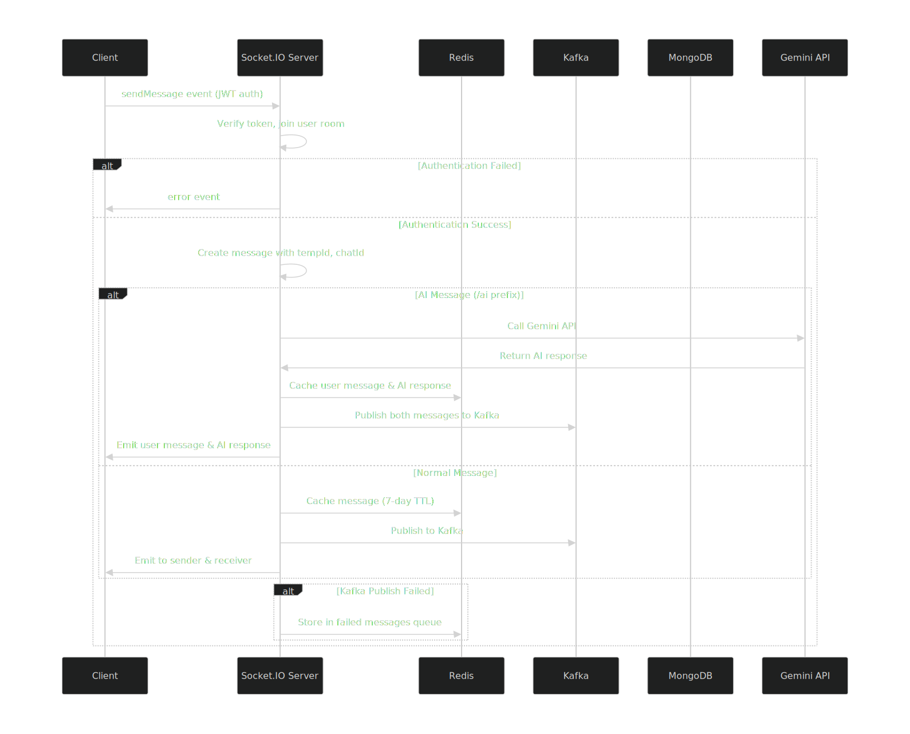

# AI Chat Application 

A scalable, real-time chat application backend built with Node.js, utilizing MongoDB for persistent storage, Redis for caching, Kafka for message queuing, and Socket.IO for real-time communication. Supports user-to-user messaging and AI-powered responses via the Gemini API. Designed for high availability, fault tolerance, and efficient message processing.


# 📌 Overview

The **AI Chat Application** is a full MERN-stack real-time messaging platform featuring:

* **Instant user-to-user chat**
* **AI-enhanced responses using Gemini API**
* **Persistent storage with MongoDB**
* **Redis-based caching & Socket.IO scaling**
* **Kafka-backed message processing**
* **Automatic retry & failure recovery**

Built to support **high-traffic**, **multi-user**, **distributed environments**.

---

# ✨ Features

### 💬 Real-Time Messaging

* Ultra-fast communication via **Socket.IO**


### 🤖 AI Message Processing

* Messages beginning with `/ai` are responded to using **Gemini API**

### 🧵 Message Persistence

* Messages stored in MongoDB
* Redis caches recent conversations
* Batch-based database writes

### 🔄 Fault Tolerance & Recovery

* Kafka publish failures stored in Redis
* Automatic retry every 30 minutes
* Durable message processing pipeline

### 🔐 Security

* JWT-secured WebSocket connections
* Secure token rotation (access + refresh tokens)

### 👥 User & Friend Management

* Add friends
* Maintain conversation threads

### 🛠 Logging & Monitoring

* Detailed logging
* Kafka UI for cluster insights

---

# 🧰 Tech Stack

### Backend

* **Node.js**, **Express**
* **Socket.IO**
* **Kafka** + **Zookeeper**
* **Redis**
* **MongoDB**
* **Gemini API**

### Frontend

* **React (Vite)**
* **Tailwind CSS**
* **Socket.IO Client**

### Infrastructure

* **Docker & Docker Compose**

## Architecture & Message Flow

### System Architecture Diagram
```
┌─────────────┐    ┌─────────────┐    ┌─────────────┐
│   Client    │    │   Client    │    │   Client    │
└──────┬──────┘    └──────┬──────┘    └──────┬──────┘
       │                  │                  │
       └──────────────────┼──────────────────┘
                          │
                 ┌────────▼────────┐
                 │Socket.IO Server │
                 └────────┬────────┘
                          │
           ┌──────────────┼──────────────┐
           │              │              │
    ┌──────▼──────┐ ┌─────▼─────┐ ┌──────▼─────┐
    │   Redis     │ │   Kafka   │ │  MongoDB   │
    │  (Caching)  │ │  (Queue)  │ │ (Storage)  │
    └─────────────┘ └───────────┘ └────────────┘
```

### Detailed Message Flow

#### 1. Message Initiation & Real-Time Delivery


#### 2. Message Persistence Pipeline


#### 3. Failed Message Recovery


## Installation

### Prerequisites
- Node.js (v16 or higher)
- Docker and Docker Compose
- MongoDB
- Redis

### Setup Instructions

1. **Clone the Repository**
   ```bash
   git clone https://github.com/shubharoydev/ai-chat-app.git
   ```

2. **Environment Configuration**
   Create `.env` file in backend folder:
   ```env
   MONGODB_URI=mongodb://localhost:27017/chatapp
   REDIS_URL=redis://localhost:6379
   GEMINI_API_KEY=<your-gemini-api-key>
   CLIENT_ORIGIN=http://localhost:5173
   PORT=3000

   #Kafka ( Use localhost since app runs outside Docker)
   KAFKA_CLIENT_ID=chat-app
   KAFKA_BROKERS=localhost:9092,localhost:9093,localhost:9094

   # JWT
   JWT_ACCESS_SECRET=<your-jwt-access-secret>
   JWT_REFRESH_SECRET=<your-jwt-refresh-secret>
   JWT_ACCESS_EXPIRY=15m
   JWT_REFRESH_EXPIRY=28d

   # Arcjet & Gemini
   ARCJET_ENV=development
   ARCJET_KEY=<your-arcjet-key>
   ```

2. **Environment Configuration**
   Create `.env` file in frontend folder:
   ```env
   VITE_API_URL=http://localhost:3000
   VITE_WS_URL=ws://localhost:3000
   ```

3. **Start Infrastructure Services**
   ```bash
   docker-compose up -d
   ```

4. **Launch Backend Application**
   ```bash
   cd backend 
   npm install
   npm run dev 
   ```

6. **Launch Frontend Application**
   ```bash
   cd frontend
   npm install
   npm run dev
   ```

7. **Access Applications**
   - Frontend: http://localhost:5173
   - Backend: http://localhost:3000
   - Kafka UI: http://localhost:8080

## Error Handling & Reliability

### Failure Recovery Strategies
- **Socket.IO**: JWT authentication failures emit error events to clients
- **Kafka**: Failed publishes stored in Redis with 7-day TTL, retried every 30 minutes
- **MongoDB**: Bulk write failures trigger exponential backoff retries (max 3 attempts)
- **Redis**: Message caching with automatic expiration

### Monitoring & Logging
- Comprehensive error logging with `logError` and `logInfo`
- Real-time client error feedback via Socket.IO
- Kafka UI for queue monitoring

## Scalability Features

### Horizontal Scaling

- **Kafka**: Three-partition distributed processing
- **Redis**: Reduces database load through intelligent caching
- **MongoDB**: Optimized bulk operations with upserts

### Performance Optimizations
- Batch message processing (5-minute intervals)
- Redis caching of recent conversations
- Connection pooling and efficient resource utilization


# 🐳 Docker Compose (Uses Docker Hub Images)

Your frontend & backend are pulled from:

* **Frontend** → `shubha69/ai_chatapp-frontend:v1`
* **Backend** → `shubha69/ai_chatapp-backend:v1`

# Folder Structure

```
ai-chat-app/
├─ docker-compose.yml
├─ .env

````

# docker-compose.yml

```yaml
services:
  zookeeper1:
    image: confluentinc/cp-zookeeper:7.6.0
    hostname: zookeeper1
    environment:
      ZOOKEEPER_SERVER_ID: 1
      ZOOKEEPER_CLIENT_PORT: 2181
      ZOOKEEPER_TICK_TIME: 2000
      ZOOKEEPER_SERVERS: zookeeper1:2888:3888;zookeeper2:2888:3888;zookeeper3:2888:3888
    ports:
      - "2181:2181"
    networks:
      - kafka-net

  zookeeper2:
    image: confluentinc/cp-zookeeper:7.6.0
    hostname: zookeeper2
    environment:
      ZOOKEEPER_SERVER_ID: 2
      ZOOKEEPER_CLIENT_PORT: 2182
      ZOOKEEPER_TICK_TIME: 2000
      ZOOKEEPER_SERVERS: zookeeper1:2888:3888;zookeeper2:2888:3888;zookeeper3:2888:3888
    ports:
      - "2182:2182"
    networks:
      - kafka-net

  zookeeper3:
    image: confluentinc/cp-zookeeper:7.6.0
    hostname: zookeeper3
    environment:
      ZOOKEEPER_SERVER_ID: 3
      ZOOKEEPER_CLIENT_PORT: 2183
      ZOOKEEPER_TICK_TIME: 2000
      ZOOKEEPER_SERVERS: zookeeper1:2888:3888;zookeeper2:2888:3888;zookeeper3:2888:3888
    ports:
      - "2183:2183"
    networks:
      - kafka-net

  kafka:
    image: confluentinc/cp-kafka:7.6.0
    hostname: kafka
    depends_on:
      - zookeeper1
      - zookeeper2
      - zookeeper3
    ports:
      - "9092:9092"
    environment:
      KAFKA_BROKER_ID: 1
      KAFKA_ZOOKEEPER_CONNECT: zookeeper1:2181,zookeeper2:2182,zookeeper3:2183
      KAFKA_LISTENERS: PLAINTEXT://0.0.0.0:9092,INTERNAL://0.0.0.0:29092
      KAFKA_ADVERTISED_LISTENERS: PLAINTEXT://localhost:9092,INTERNAL://kafka:29092
      KAFKA_LISTENER_SECURITY_PROTOCOL_MAP: PLAINTEXT:PLAINTEXT,INTERNAL:PLAINTEXT
      KAFKA_INTER_BROKER_LISTENER_NAME: INTERNAL
      KAFKA_OFFSETS_TOPIC_REPLICATION_FACTOR: 1
      KAFKA_DEFAULT_REPLICATION_FACTOR: 1
      KAFKA_NUM_PARTITIONS: 3
      KAFKA_MIN_INSYNC_REPLICAS: 1
    networks:
      - kafka-net

  kafka2:
    image: confluentinc/cp-kafka:7.6.0
    hostname: kafka2
    depends_on:
      - zookeeper1
      - zookeeper2
      - zookeeper3
    ports:
      - "9093:9093"
    environment:
      KAFKA_BROKER_ID: 2
      KAFKA_ZOOKEEPER_CONNECT: zookeeper1:2181,zookeeper2:2182,zookeeper3:2183
      KAFKA_LISTENERS: PLAINTEXT://0.0.0.0:9093,INTERNAL://0.0.0.0:29093
      KAFKA_ADVERTISED_LISTENERS: PLAINTEXT://localhost:9093,INTERNAL://kafka2:29093
      KAFKA_LISTENER_SECURITY_PROTOCOL_MAP: PLAINTEXT:PLAINTEXT,INTERNAL:PLAINTEXT
      KAFKA_INTER_BROKER_LISTENER_NAME: INTERNAL
      KAFKA_OFFSETS_TOPIC_REPLICATION_FACTOR: 1
      KAFKA_DEFAULT_REPLICATION_FACTOR: 1
      KAFKA_NUM_PARTITIONS: 3
      KAFKA_MIN_INSYNC_REPLICAS: 1
    networks:
      - kafka-net

  kafka3:
    image: confluentinc/cp-kafka:7.6.0
    hostname: kafka3
    depends_on:
      - zookeeper1
      - zookeeper2
      - zookeeper3
    ports:
      - "9094:9094"
    environment:
      KAFKA_BROKER_ID: 3
      KAFKA_ZOOKEEPER_CONNECT: zookeeper1:2181,zookeeper2:2182,zookeeper3:2183
      KAFKA_LISTENERS: PLAINTEXT://0.0.0.0:9094,INTERNAL://0.0.0.0:29094
      KAFKA_ADVERTISED_LISTENERS: PLAINTEXT://localhost:9094,INTERNAL://kafka3:29094
      KAFKA_LISTENER_SECURITY_PROTOCOL_MAP: PLAINTEXT:PLAINTEXT,INTERNAL:PLAINTEXT
      KAFKA_INTER_BROKER_LISTENER_NAME: INTERNAL
      KAFKA_OFFSETS_TOPIC_REPLICATION_FACTOR: 1
      KAFKA_DEFAULT_REPLICATION_FACTOR: 1
      KAFKA_NUM_PARTITIONS: 3
      KAFKA_MIN_INSYNC_REPLICAS: 1
    networks:
      - kafka-net

  kafka-ui:
    image: provectuslabs/kafka-ui:latest
    depends_on:
      - kafka
      - kafka2
      - kafka3
    ports:
      - "8080:8080"
    environment:
      DYNAMIC_CONFIG_ENABLED: "true"
      KAFKA_CLUSTERS_0_NAME: local
      KAFKA_CLUSTERS_0_BOOTSTRAPSERVERS: kafka:29092,kafka2:29093,kafka3:29094
    networks:
      - kafka-net

  backend:
    image: shubha69/ai_chatapp-backend:v1
    container_name: my-backend
    ports:
      - "${PORT}:3000"
    env_file:
      - ./.env
    environment:
      PORT: ${PORT}
      MONGODB_URI: ${MONGODB_URI}
      KAFKA_BROKERS: ${KAFKA_BROKERS}
      REDIS_URL: ${REDIS_URL}
      GEMINI_API_KEY: ${GEMINI_API_KEY}
      CLIENT_ORIGIN: ${CLIENT_ORIGIN}
      KAFKA_CLIENT_ID: ${KAFKA_CLIENT_ID}
      JWT_ACCESS_SECRET: ${JWT_ACCESS_SECRET}
      JWT_REFRESH_SECRET: ${JWT_REFRESH_SECRET}
      JWT_ACCESS_EXPIRY: ${JWT_ACCESS_EXPIRY}
      JWT_REFRESH_EXPIRY: ${JWT_REFRESH_EXPIRY}
      ARCJET_ENV: ${ARCJET_ENV}
      ARCJET_KEY: ${ARCJET_KEY}
    depends_on:
      - kafka
      - kafka2
      - kafka3
    networks:
      - kafka-net

  frontend:
    image: shubha69/ai_chatapp-frontend:v1
    container_name: my-frontend
    env_file:
      - ./.env
    environment:
     VITE_API_URL: ${VITE_API_URL}
     VITE_WS_URL: ${VITE_WS_URL}
    ports:
      - "5173:80"
    depends_on:
      - backend
    networks:
      - kafka-net

networks:
  kafka-net:
    driver: bridge 
````

---

# .env file

```env
MONGODB_URI=
REDIS_URL=
GEMINI_API_KEY=
CLIENT_ORIGIN=
PORT=3000

#Kafka 
KAFKA_CLIENT_ID=chat-app
KAFKA_BROKERS=kafka:29092,kafka2:29093,kafka3:29094

# JWT
JWT_ACCESS_SECRET=
JWT_REFRESH_SECRET=
JWT_ACCESS_EXPIRY=15m
JWT_REFRESH_EXPIRY=28d

# Arcjet 
ARCJET_ENV=
ARCJET_KEY=


VITE_API_URL=http://localhost:3000
VITE_WS_URL=ws://localhost:3000
```


# ▶️ Run Everything

Start all services:

```bash
docker-compose up -d
````


### 📌 View Logs

#### 🔹 Frontend Logs

```bash
docker-compose logs -f frontend
```

#### 🔹 Backend Logs

```bash
docker-compose logs -f backend
```

This will:

* Start Zookeeper (3 nodes)
* Start Kafka (3 nodes)
* Start Kafka UI
* Start backend container
* Start frontend container

---

# 🌐 Access the Applications

| Service           | URL                                            |
| ----------------- | ---------------------------------------------- |
| **Frontend (UI)** | [http://localhost:5173](http://localhost:5173) |
| **Backend API**   | [http://localhost:3000](http://localhost:3000) |
| **Kafka UI**      | [http://localhost:8080](http://localhost:8080) |

---

# 🧪 Test Setup

### Test Backend API

```bash
 http://localhost:3000/api/health
```

### Test Frontend

Open browser:

👉 [http://localhost:5173](http://localhost:5173)

---

# 🔮 Future Roadmap

* User online/offline presence
* Media sharing (images, videos)
* Kubernetes deployment 
---

## Contributing

1. Fork the repository
2. Create feature branch: `git checkout -b feature/amazing-feature`
3. Commit changes: `git commit -m "Add amazing feature"`
4. Push to branch: `git push origin feature/amazing-feature`
5. Open a Pull Request

## License

This project is licensed under the MIT License. See [LICENSE](https://opensource.org/licenses/MIT) file for details.
