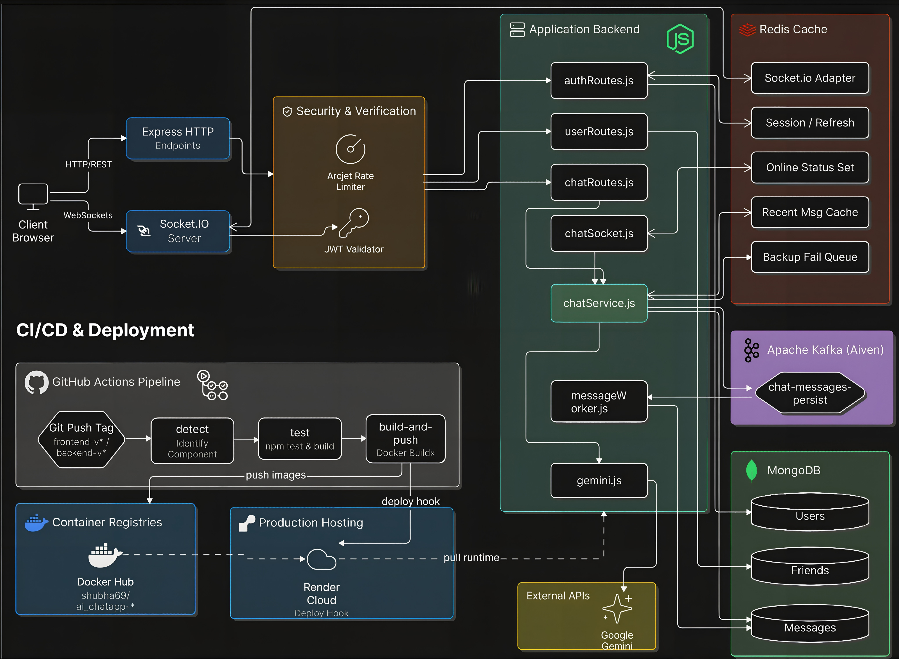

# 🚀 AI Chat Application

A scalable, real-time chat backend built with **Node.js**, designed for high-traffic and distributed environments.

It combines:

* **WebSockets** for instant delivery
* **Redis** for fast caching
* **Apache Kafka** (3-broker cluster) for distributed streaming
* **Aiven Cloud kafka Support**
* **MongoDB** for long-term persistence
* **Gemini API** for AI-powered responses

The system follows a **Real-Time First + Asynchronous Persistence** architecture and is production-ready for distributed deployments.

---

# 📌 Overview

The AI Chat Application is architected around:

* Instant message delivery via Socket.IO
* Redis caching (cache-aside strategy)
* Kafka-based asynchronous persistence
* Bulk MongoDB writes with idempotency
* Offset commits only after successful DB persistence
* Self-healing retry & recovery mechanisms

Designed for:

* Zero message loss
* Horizontal scalability
* High-throughput environments

---

# ✨ Features

## 🔹 Real-Time Messaging

* Instant user-to-user delivery
* Optimistic UI support
* JWT-secured WebSocket authentication

## 🔹 AI-Powered Chat

* `/ai` prefixed messages trigger Gemini API
* AI responses are delivered as standard chat messages

## 🔹 Distributed Kafka Persistence

* 3-broker Kafka cluster
* Partition-based scaling
* Idempotent message handling via `messageId`
* Offset commit after MongoDB bulk write

## 🔹 Redis Caching

* Recent conversation storage with TTL
* Cache-aside strategy
* Automatic read-repair (self-healing cache)

## 🔹 Fault Tolerance

* Kafka failure → Redis backup queue
* Background retry worker
* Worker pause/resume memory protection
* MongoDB failure → buffer preservation

---

# 🧰 Technology Stack

## Backend

* Node.js
* Express
* Socket.IO
* Apache Kafka
* Redis
* MongoDB
* Gemini API

## Frontend

* React (Vite)
* Tailwind CSS
* Socket.IO Client

## Infrastructure (Local Kafka Mode)

* Docker
* Docker Compose
* 3-node Kafka Cluster
* Kafka UI (Docker-only monitoring)

---

## 📄 Documentation

This project includes detailed documentation to help you understand the API and the chat persistence architecture.

### 📌 Available Docs

* 🔗 **Chat Persistence Flow** – Understand how chat interactions are stored, retrieved, and persisted across sessions.
  👉 [docs/CHAT_PERSISTANCE_FLOW.md](https://github.com/shubharoydev/ai-chat-app/blob/main/docs/CHAT_PERSISTANCE_FLOW.md)

* 🔗 **API Documentation** – Complete reference for all API endpoints, request/response schemas, authentication, and usage examples.
  👉 [docs/API_DOCUMENTATION.md](https://github.com/shubharoydev/ai-chat-app/blob/main/docs/API_DOCUMENTATION.md)

---

## System Architecture Diagram



---
## 📦 Versioning

Use the following Docker images from Docker Hub:

```
shubha69/ai_chatapp-frontend:latest
shubha69/ai_chatapp-backend:latest
```

Docker Hub links:

* Backend: [https://hub.docker.com/r/shubha69/ai_chatapp-backend](https://hub.docker.com/r/shubha69/ai_chatapp-backend)
* Frontend: [https://hub.docker.com/r/shubha69/ai_chatapp-frontend](https://hub.docker.com/r/shubha69/ai_chatapp-frontend)

---

# ⚡ Quick Start

### 1. Start Infrastructure (Kafka, Zookeeper, Redis, Mongo)

If you are running the app locally, you need the infrastructure running in Docker:

```bash
docker-compose up -d zookeeper1 zookeeper2 zookeeper3 kafka kafka2 kafka3 kafka-ui
# Ensure you also have MongoDB and Redis running locally or in Docker or Cloud Service
```

### 2. Backend Setup

```bash
cd backend
npm install
npm run dev
```

### 3. Frontend Setup

```bash
cd frontend
npm install
npm run dev
```

---

### ✅ Version Compatibility

#### 🔹 `shubha69/ai_chatapp-backend:1.5.0` and Above

* Supports **cloud-based Aiven Kafka only**
* Designed for cloud deployments
* ❌ Does **NOT** support local Docker Kafka setup

---

#### 🔹 `shubha69/ai_chatapp-backend1.4.0` and Below

* Supports **local Docker Kafka setup**
* Can be used for local development environments
* Also compatible with custom Kafka configurations
---

### 🔧 Custom Kafka Configuration

If you want to modify the Kafka configuration:

1. Update the Kafka setup code
2. Build your own backend Docker image
3. Push it to your Docker Hub repository
4. Use your custom version tag

---


# ⚙️ Running the Application

## 🐳 Run Local Kafka Cluster (Docker Only)

Your provided Docker Compose setup includes:

* 3 Zookeeper nodes
* 3 Kafka brokers
* Kafka UI (for monitoring only in Docker mode)

Start Kafka cluster:

```bash
docker-compose up -d zookeeper1 zookeeper2 zookeeper3 kafka kafka2 kafka3 kafka-ui
```

Kafka will be available on:

* `localhost:9092`
* `localhost:9093`
* `localhost:9094`

Kafka UI (Docker-only):

```
http://localhost:8080
```

⚠️ Kafka UI is **only for local Docker deployments**.
It is not used in cloud-managed Kafka setups.

---

# 📊 Monitoring (Local Docker Mode Only)

When using Docker Kafka:

* Kafka UI → topic & partition monitoring
* Offset commit tracking
* Replication visibility
* Broker health checks

In cloud mode, use your provider’s monitoring tools instead.

---

# 🚀 Scalability

* Multiple workers across Kafka partitions
* Kafka auto-rebalancing
* Backend replicas behind load balancer
* Bulk MongoDB writes
* Composite DB indexing

---

# 🤝 Contributing

We welcome contributions to improve scalability, reliability, and features.

### Contribution Workflow

1. Fork the repository
2. Create a feature branch

   ```
   git checkout -b feature/your-feature-name
   ```
3. Make your changes following project architecture guidelines
4. Ensure linting and formatting are clean
5. Commit with a clear message

   ```
   git commit -m "feat: add your feature"
   ```
6. Push to your fork

   ```
   git push origin feature/your-feature-name
   ```
7. Open a Pull Request

---

# 🔮 Roadmap

* End-to-End Encryption (E2EE)
* Media & file sharing
* Message reactions

---

# 🏁 Final Notes

This system is designed with **distributed systems best practices** in mind:

* Event-driven architecture
* Strong durability guarantees
* Fault-tolerant recovery
* Horizontal scalability

Whether running locally with Docker Kafka or using a managed Kafka provider, the architecture remains consistent and production-ready.

If you’re building scalable real-time systems — this project provides a strong, extensible foundation.
