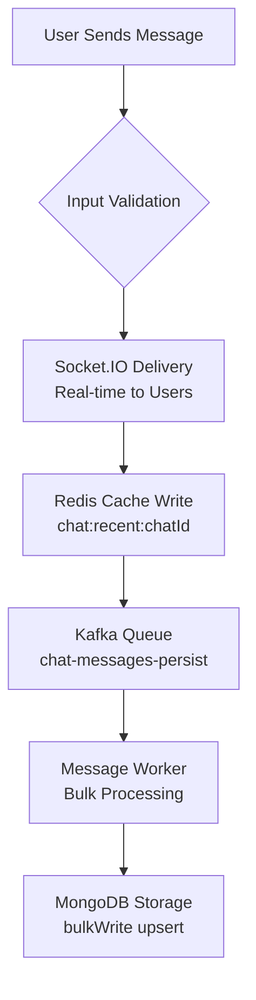
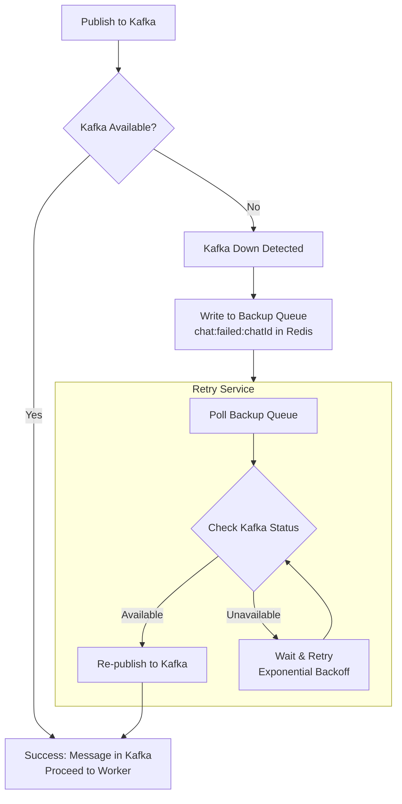
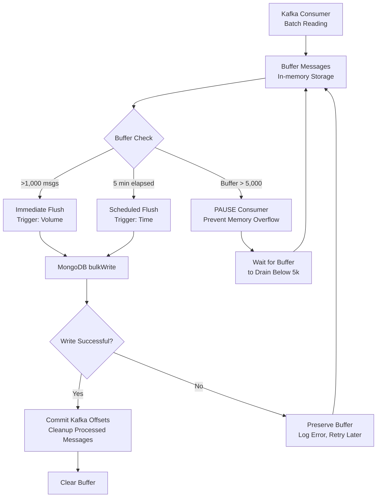
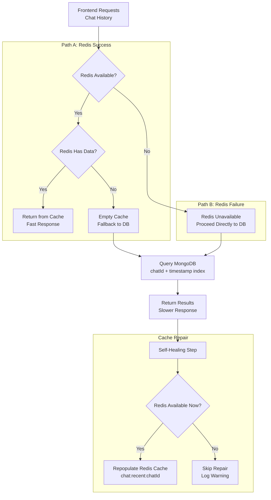
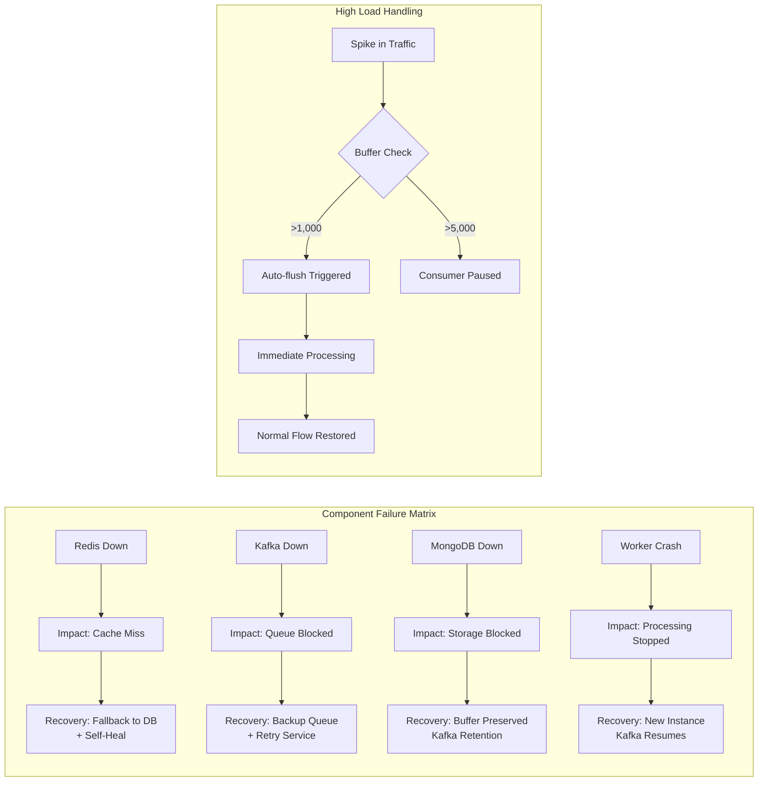

# Chat Data Persistence & Flow

This document details the lifecycle of a chat message, highlighting the "Zero Message Loss" architecture using Redis, Kafka, and MongoDB with enhanced bulk processing and Kafka storage management.

## Architecture Guidelines

-   **Real-Time First**: Users see messages immediately via WebSocket (Socket.IO).
-   **Cache-Aside**: Recent messages are served from Redis for speed.
-   **Async Persistence**: Long-term storage is handled asynchronously via Kafka to prevent database bottlenecks.
-   **Fault Tolerance**: The system is designed to self-heal and handle outages in Redis or Kafka.
-   **Bulk Optimization**: Intelligent batching for high-throughput scenarios.
-   **Storage Management**: Automatic Kafka cleanup to prevent storage bloat.



---

## 1. Sending a Message (The Write Path)

When a user sends a message (`POST /api/chat/messages` or Socket `sendMessage`):

1.  **Validation**: Input is validated (Joi schemas) for content, friendId, and user permissions.

2.  **Immediate Delivery (Socket.IO)**:
    -   The message is emitted to both the sender and receiver immediately.
    -   *User Experience*: Instant feedback (Optimistic UI).
    -   Includes temporary ID for client-side tracking.

3.  **Caching (Redis - Recent History)**:
    -   Message is pushed to a Redis list: `chat:recent:{chatId}`.
    -   TTL: 7 Days.
    -   **Fault Tolerance**: If Redis is down, this step is skipped (logged), but the flow continues.

4.  **Queueing (Kafka - Persistence)**:
    -   Message is published to topic: `chat-messages-persist`.
    -   Includes unique `messageId` for deduplication.
    -   **Fault Tolerance (Kafka Down)**:
        -   If Kafka is unreachable, the system writes the message to a "Backup Redis Queue": `chat:failed:{chatId}`.
        -   A background job (`retryFailedMessages`) periodically attempts to republish these to Kafka.



---

## 2. Processing & Storage (Enhanced Worker Path)

A dedicated background worker (`messageWorker.js`) handles storage with intelligent batching:

### 2.1 Consumption & Buffering

1.  **Consumption**:
    -   Consumes messages from `chat-messages-persist` topic in batches.
    -   Uses `autoCommit: false` for precise offset control.

2.  **Intelligent Buffering**:
    -   Messages are stored in an in-memory buffer.
    -   **Flow Control**: If the buffer exceeds 5,000 messages, the consumer pauses to prevent Memory Overload.
    -   **Dual Trigger System**:
        -   **Time-based**: Every 5 minutes
        -   **Volume-based**: When buffer reaches 1,000 messages (immediate flush)

### 2.2 Bulk Processing

3.  **Enhanced Bulk Write (MongoDB)**:
    -   Uses `Message.bulkWrite` with `upsert: true` based on unique `messageId`.
    -   **Idempotency**: Duplicate messages (same `messageId`) won't create duplicates.
    -   **Performance**: Bulk operations significantly improve throughput.
    -   **Logging**: Detailed metrics on insert/modify counts.

4.  **Kafka Storage Management**:
    -   **Offset Commit**: Kafka offsets are committed **only after** successful MongoDB write.
    -   **Automatic Cleanup**: Committed offsets effectively remove processed messages from Kafka.
    -   **Storage Efficiency**: Prevents Kafka topic from growing indefinitely.

### 2.3 Error Handling & Recovery

5.  **Robust Error Handling**:
    -   **DB Failures**: If MongoDB write fails, buffer is preserved for retry.
    -   **Parse Errors**: Malformed messages are logged and skipped (offset committed).
    -   **Consumer Pause**: On critical errors, consumer pauses to prevent message loss.



---

## 3. Retrieving Messages (The Read Path)

When the frontend requests chat history (`GET /messages/:friendId`):

1.  **Check Redis**:
    -   Attempts to read from `chat:recent:{chatId}`.
    -   Returns last 20 messages by default (configurable).
    -   **Fault Tolerance**: If Redis is down or returns an error, proceeds to MongoDB.

2.  **Fallback to MongoDB**:
    -   If Redis is empty or unreachable, queries the `messages` collection in MongoDB.
    -   Uses indexed query on `chatId` and `timestamp` for efficient retrieval.
    -   Pagination support for large chat histories.

3.  **Self-Healing (Read Repair)**:
    -   If data was fetched from MongoDB (because Redis was empty/down), the system pushes these messages back into Redis.
    -   This ensures that subsequent requests are served from the cache, "healing" the cache state automatically.



---

## 4. Enhanced Worker Features

### 4.1 Bulk Threshold Optimization

```javascript
const BULK_THRESHOLD = 1000; // Auto-flush at 1000 messages
const FLUSH_INTERVAL = 5 * 60 * 1000; // 5 minutes
```

- **High Throughput**: During peak usage, buffer reaches threshold quickly → immediate flush
- **Low Activity**: During normal usage, time-based flush ensures regular persistence
- **Memory Efficiency**: Controlled buffer size prevents memory issues

### 4.2 Kafka Storage Management

```javascript
// After successful DB write
for (const { kafkaMsg, resolveOffset } of messageBuffer) {
  resolveOffset(kafkaMsg.offset); // Commit offset → removes from Kafka
}
```

- **Automatic Cleanup**: Processed messages are automatically removed from Kafka
- **Storage Efficiency**: Prevents unlimited Kafka topic growth
- **Cost Optimization**: Reduces storage requirements in cloud environments

### 4.3 Enhanced Monitoring

```javascript
logInfo('MongoDB bulkWrite completed', {
  insertedCount: result.upsertedCount || 0,
  modifiedCount: result.modifiedCount || 0,
  totalProcessed: messageBuffer.length,
});
```

- **Performance Metrics**: Track insert/modify ratios
- **Throughput Monitoring**: Monitor processing rates
- **Error Tracking**: Detailed error logging for debugging

---

## 5. Failure Scenarios & Recovery



| Failure | Impact | Recovery Mechanism |
| :--- | :--- | :--- |
| **Redis Down** | No cache hits. Slightly higher DB load. | **Read Path**: Falls back to Mongo. **Write Path**: Skips cache write, goes to Kafka. **Self-Heal**: When Redis returns, next read repopulates it. |
| **Kafka Down** | Messages not persisted immediately. | **Write Path**: Saves to `chat:failed` Redis key. **Recovery**: Background job retries publishing to Kafka later. |
| **MongoDB Down** | Worker cannot flush. | **Worker**: Keeps messages in memory (up to limit). **Kafka**: Retains messages in topic (retention policy). **Recovery**: Worker resumes processing when DB returns. |
| **Worker Crash** | Processing stops. | **Kafka**: Offsets were not committed. New worker instance picks up from last commit. Duplicate processing handled by `upsert`. |
| **High Load** | Buffer fills quickly. | **Auto-flush**: Triggers immediate flush at 1000 messages. **Flow Control**: Consumer pauses at 5000 messages to prevent memory overload. |

---

## 6. Performance Optimizations

### 6.1 Database Optimizations

- **Unique Index**: `messageId` with unique constraint for fast upserts
- **Composite Index**: `chatId + timestamp` for efficient chat history queries
- **Bulk Operations**: `bulkWrite` with `ordered: false` for parallel processing

### 6.2 Memory Management

- **Controlled Buffer**: Maximum 5000 messages prevents memory issues
- **Immediate Flush**: Auto-flush at 1000 messages for high throughput
- **Garbage Collection**: Buffer cleared after successful commits

### 6.3 Kafka Optimizations

- **Batch Processing**: Consumes messages in batches for efficiency
- **Offset Management**: Precise control over message processing
- **Storage Cleanup**: Automatic removal of processed messages

---

## 7. Monitoring & Observability

### 7.1 Key Metrics

- **Message Throughput**: Messages processed per second
- **Buffer Utilization**: Current buffer size vs thresholds
- **Error Rates**: Failed operations and error types
- **Latency**: Time from message send to DB persistence

### 7.2 Logging

```javascript
logInfo('Bulk threshold reached, flushing immediately', {
  count: messageBuffer.length,
  threshold: BULK_THRESHOLD,
});

logError('MongoDB bulkWrite failed', { 
  error: err.message,
  bufferSize: messageBuffer.length 
});
```

### 7.3 Health Checks

- **Worker Status**: Active processing or paused
- **Buffer Health**: Current buffer size and last flush time
- **Kafka Connectivity**: Consumer connection status
- **MongoDB Connectivity**: Database connection status

---

## 8. Configuration

### 8.1 Tunable Parameters

```javascript
const BULK_THRESHOLD = 1000;     // Messages for immediate flush
const FLUSH_INTERVAL = 300000;    // 5 minutes in milliseconds
const MAX_BUFFER_SIZE = 5000;     // Maximum buffer before pause
```

### 8.2 Environment-Specific Settings

- **Development**: Lower thresholds for faster debugging
- **Production**: Optimized for throughput and efficiency
- **Testing**: Configurable values for load testing

---

## 9. Best Practices

### 9.1 Message Design

- **Unique IDs**: Every message has a unique `messageId` for deduplication
- **Immutable Content**: Message content never changes after creation
- **Consistent Schema**: All messages follow the same structure

### 9.2 Error Handling

- **Never Lose Messages**: Buffer preserved on failures
- **Graceful Degradation**: System continues operating with reduced functionality
- **Comprehensive Logging**: All errors logged with context

### 9.3 Scaling Considerations

- **Horizontal Scaling**: Multiple worker instances can process different partitions
- **Load Balancing**: Kafka automatically balances load across consumers
- **Resource Management**: Memory and connection limits properly configured